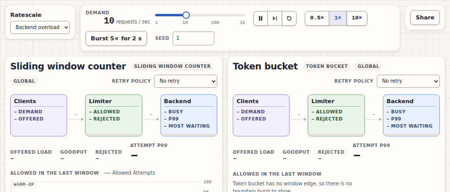
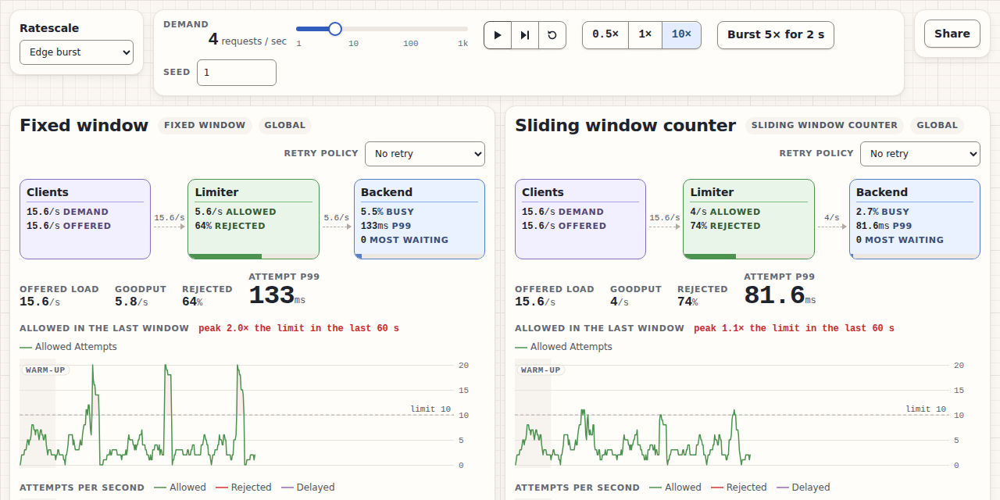

# Ratescale

Ratescale is a rate-limiting simulator for students. The same seeded traffic runs through two rate limiters side by side, you raise the load until something breaks, and the page shows what broke and why.

It is for anyone who has read "a token bucket refills at N per second" and wants to see what that means when traffic arrives in bursts. You do not need a queueing theory course; every number on the page is explained in plain words.

**Live:** [rate-limiter-simulator-zeta.vercel.app](https://rate-limiter-simulator-zeta.vercel.app/). Try [Backend overload at 30 Requests per second](https://rate-limiter-simulator-zeta.vercel.app/?s=backend-overload&seed=1&d=30&r=none.none), where the sliding window counter's Backend fails.

## Motivation

Diagrams of rate limiting algorithms show the rule, not what it does under load. "Fixed window allows 10 per second" sounds safe until a burst lands on both sides of a window edge and 20 get through. "Both limiters allow 70 a second" sounds equal until one lets all 70 in at once and the service behind it starts dropping work.

Ratescale exists to make those differences visible and trustworthy. Nothing is animated to look right: every number comes from a discrete-event simulation that admits real Attempts and counts them, and the same seed always replays the same run. A student can change one setting, watch what happens, and send the exact setup to someone else.

## Build status

[](https://github.com/sahiljadhav7/rate-limiter-simulator/actions/workflows/ci.yml)

Every push and pull request to `main` runs lint, the format check, the test suite and the production build on GitHub Actions (`.github/workflows/ci.yml`). Vercel deploys `main` and runs the tests again before building (`vercel.json`), so a failing test blocks a deploy.

## Code style

[](https://prettier.io) [](https://oxc.rs/docs/guide/usage/linter)

- **[Prettier](https://prettier.io)**: no semicolons, single quotes, trailing commas, 100 characters a line (`.prettierrc.json`). Check with `bun run format:check`, fix with `bun run format`.
- **[oxlint](https://oxc.rs)** with the React, TypeScript and oxc plugins (`.oxlintrc.json`). Run `bun run lint`.
- **TypeScript in strict mode**, with `noUncheckedIndexedAccess` and `exactOptionalPropertyTypes`.
- **One vocabulary.** Code, tests and on-screen text use the domain words defined in [`CONTEXT.md`](CONTEXT.md): Request, Attempt, Variant, Demand, Goodput, Finding.

## Screenshots



_Backend overload at seed 1: Demand dragged from 10 to 40 Requests per second. The sliding window counter's Backend says FAILING with 31 to 34% LOST in this recording; the token bucket's keeps up._



_Edge burst at seed 1: the fixed window lets 2.0× its limit through across each window edge; the sliding window counter peaks at 1.1×._

## Tech/framework used

**Built with**

- [React 19](https://react.dev) for the page, with hand-drawn SVG charts and no chart library
- [TypeScript 6](https://www.typescriptlang.org) in strict mode
- [Vite 8](https://vite.dev) for the dev server and build
- [Vitest 5](https://vitest.dev) for the tests
- [Bun 1.3.9](https://bun.sh) as package manager and script runner
- [Caveat](https://github.com/googlefonts/caveat) for the handwritten notes, self-hosted with [`@fontsource/caveat`](https://fontsource.org/fonts/caveat)
- [GitHub Actions](https://github.com/features/actions) for continuous integration, [Vercel](https://vercel.com) for hosting

The simulation itself (`src/sim`) has no dependencies at all.

## Features

- **Side by side on identical traffic.** Every Variant sees the exact same Requests at the exact same times, so any difference between panels comes from the rate limiter and Retry Policy alone.
- **Real numbers.** A discrete-event simulation counts every Attempt; percentiles come from recorded latencies, and a value with nothing to measure shows a dash, never a plausible guess.
- **Deterministic.** The same seed and the same Demand changes replay the same run, down to the last Attempt.
- **Live controls.** Drag Demand from 1 to 1,000 Requests per second, burst 5× for 2 seconds, pause, step one second, change speed, pick a Retry Policy per Variant, change the seed.
- **Three rate limiters:** fixed window, sliding window counter and token bucket, each counting globally or per Client.
- **Five Retry Policies:** no retry, retry at once, back off, back off with jitter, and wait for Retry-After.
- **A Backend that can fail.** Slots, a bounded queue, service times that vary, Attempts shed when the queue is full, and timed-out work that still uses its slot. A failing Backend turns red and says how much it lost.
- **Shareable links.** The address bar holds the setup; **Share** copies it, and the link reopens the same experiment.
- **It explains itself.** Each Scenario has two handwritten notes: what you are seeing and why, and what the model leaves out.

## Code example

`src/sim` and `src/runner` know nothing about the page, so a run can be driven from a script. Save this as `example.ts` in the project root:

```ts
import { createRunner } from './src/runner/runner.ts'
import { backendOverloadScenario } from './src/ui/scenarios/backend-overload.ts'

// Backend overload at 30 Requests per second: the same seeded traffic through both Limiters.
const scenario = {
  ...backendOverloadScenario,
  traffic: { ...backendOverloadScenario.traffic, demandRps: 30 },
}
const runner = createRunner(scenario, { eventBudget: Infinity })
while (runner.view().simMs < 60_000) runner.tick(100) // one simulated minute

for (const variant of runner.view().variants) {
  const { requests } = variant.totals
  const finding = variant.findings[0]
  console.log(
    `${variant.label}: ${requests.succeeded} of ${requests.created} Requests succeeded,`,
    finding ? `${finding.label} (${finding.severity})` : 'no Finding',
  )
}
```

`bun example.ts` prints the same lines every time:

```
Sliding window counter: 700 of 1772 Requests succeeded, Queue overflow (broken)
Token bucket: 943 of 1772 Requests succeeded, no Finding
```

## Installation

You need [Bun](https://bun.sh) 1.3.9 or later and Git.

1. Clone the repository:

   ```sh
   git clone https://github.com/sahiljadhav7/rate-limiter-simulator.git
   cd rate-limiter-simulator
   ```

2. Install the dependencies from the lockfile:

   ```sh
   bun install --frozen-lockfile
   ```

3. Start the dev server and open http://localhost:5173:

   ```sh
   bun run dev
   ```

4. For a production build, type check and build into `dist/`, then serve it at http://localhost:4173:

   ```sh
   bun run build
   bun run preview
   ```

## API reference

The project is small, so the reference is the source, documented where it is defined. The main entry points:

| Module | What it gives you |
| --- | --- |
| [`src/runner/runner.ts`](src/runner/runner.ts) | `createRunner(scenario, options)`: `tick(wallMs)`, `view()`, `applyControl(change)`, `pause`, `resume`, `step`, `reset`, `restart`, `setSpeed` |
| [`src/runner/scenario.ts`](src/runner/scenario.ts) | The `Scenario` and `VariantConfig` types, and `checkScenario` |
| [`src/sim/index.ts`](src/sim/index.ts) | Everything the runner and page build on: `createEngine`, `createLimiter`, `LimiterSpec`, `RetryPolicy`, `BackendSpec`, `TrafficSpec`, `Snapshot`, `createDiagnoser` and `Finding` |
| [`src/ui/scenarios/`](src/ui/scenarios) | The two Scenarios, with the arithmetic behind their numbers in each file's comment |
| [`src/ui/share/url-state.ts`](src/ui/share/url-state.ts) | `shareUrl` and `parseShareState`, the share link format |

The domain words used in every name are defined in [`CONTEXT.md`](CONTEXT.md).

## Tests

The suite is [Vitest](https://vitest.dev). Run it with:

```sh
bun run test         # once
bun run test:watch   # rerun on every change
bunx vitest run tests/limiters.test.ts   # one file
```

Use `bun run test`, not `bun test`: the second starts Bun's own test runner, which finds nothing useful here.

What the tests check:

- **Invariants** (`tests/invariants.test.ts`): every Attempt ends exactly one way and every Request is accounted for, no Request makes more Attempts than its Retry Policy allows, no count is negative or NaN, utilization stays between 0 and 1, the queue never passes its limit, and the per-second numbers add up to the totals. Checked for every rate limiter, Retry Policy and traffic shape together.
- **Limiters** (`tests/limiters.test.ts`): each algorithm's counting rules, globally and per Client, and how they differ on the same traffic: across a window edge only fixed window lets about twice its limit through, and after a burst and a quiet spell the sliding window counter still remembers the burst.
- **Queueing** (`tests/backend.test.ts`): utilization against theory, with fixed seeds and explicit tolerance bands, so no test passes on some seeds and fails on others.
- **Replay** (`tests/runner.test.ts`): a run rebuilt from its seed and its recorded Demand changes gives the identical numbers.
- **Scenarios** (`tests/scenario-findings.test.ts`, `tests/scenario-edge-burst.test.ts`): each lesson is visible where it should be and calm where it should be.
- **Share links and notes** (`tests/share-state.test.ts`, `tests/scenario-text.test.ts`): links round-trip and fall back safely; every Scenario's notes are present, short enough and use the project's words.

## How to use?

1. Open the [live site](https://rate-limiter-simulator-zeta.vercel.app/). It starts on **Backend overload**, calm at 10 Requests per second.
2. Read the two handwritten notes under the panels: what to watch, and what the model leaves out.
3. Drag **Demand** up to 30. Within a few bursts the sliding window counter's Backend turns red and says FAILING with the share it lost; the token bucket's stays blue.
4. Change a panel's **Retry Policy** to "Retry at once" and watch Offered Load climb above Demand as failed Attempts come straight back.
5. Pick **Edge burst** in the Scenario menu and watch the fixed window's chart reach 2.0× its limit at every window edge, while the sliding window counter stays near 1×.
6. Use **Pause** and **Step** to look at one second at a time, **10×** to fast forward, and **Burst 5× for 2 s** to add a spike.
7. Press **Share** to copy a link to exactly this setup. The address bar always holds it too, so a reload keeps it.

Share links look like `?s=backend-overload&seed=1&d=10&r=none.immediate`:

| Key | Meaning |
| --- | --- |
| `s` | Scenario: `backend-overload` or `edge-burst` |
| `seed` | The seed every random stream starts from, a whole number from 0 to 4,294,967,295 |
| `d` | Demand: new Requests per second, from 0 to 1,000 |
| `r` | Each Variant's Retry Policy, in panel order, joined by `.`: `none`, `immediate`, `backoff`, `backoff-jitter` or `retry-after` |

Anything missing or invalid falls back to the Scenario's own value, one key at a time. A link restores the setup, not the run: it opens at 0 seconds, ready to drag.

## Contribute

Issues and pull requests are welcome. The rules every change follows are in [`CLAUDE.md`](CLAUDE.md); the short version:

- **The numbers have to be true.** Every metric is measured from simulated events. A metric with no meaningful value shows a dash.
- **Keep runs deterministic.** No `Date.now()` or `Math.random()` in `src/sim`; the only clock is the simulated one and the only randomness is the seeded streams.
- **`src/sim` stays free of the page:** no React, no DOM, no timers, no global state.
- **Prove it.** Work is finished when a test or script prints real output that shows the behaviour. Statistical tests use a fixed seed, a long enough run and an explicit tolerance band.
- **Before opening a pull request**, run `bun run lint`, `bun run format:check`, `bun run test` and `bun run build`; CI runs the same four.

Adding something specific has its own checklist in [`CLAUDE.md`](CLAUDE.md):

- **A rate limiter algorithm:** a test that it behaves differently from every existing one on the same traffic.
- **A Scenario:** one lesson, visible at default settings or after one slider move, with a "what this models and leaves out" note.
- **A diagnosis rule:** thresholds as named constants with the measurement behind them, and a triggering and a healthy fixture.

Visual work under `src/ui/` follows [`DESIGN.md`](DESIGN.md) (tokens, layout, charts, accessibility). Plans and tickets are in [`BaseConcept.md`](BaseConcept.md); design decisions are in [`docs/adr/`](docs/adr).

## Credits

- [Breakscale](https://github.com/xevrion/breakscale) ([breakscale.tech](https://breakscale.tech/)) inspired the idea of a simulator that breaks under load and explains why, and its visual style (graph paper, floating islands, handwritten notes). The name, wording and layout are Ratescale's own.
- [Caveat](https://github.com/googlefonts/caveat) by The Caveat Project Authors, under the SIL Open Font License, for the handwritten notes.

## Anything else that seems useful

### Architecture

```
src/sim/      the engine: event loop, traffic, limiters, Backend, metrics, diagnosis. Pure TypeScript
src/runner/   builds one engine per Variant, moves them forward together, enforces the event budget
src/ui/       React: panels, charts, controls, notes, Share
tests/        invariants, limiters, queueing behaviour, diagnosis, Scenarios
```

- **The engine is a discrete-event simulation.** Each Variant has its own event queue: Attempts arrive, the rate limiter decides (allow, reject or delay), the Backend starts or queues or sheds them, and timeouts and retries are scheduled as events.
- **Determinism.** Traffic, service times and retry jitter each draw from their own seeded stream, so an extra draw in one never shifts the others. Events at the same time run in the order they were scheduled.
- **The event budget.** Each animation frame advances simulated time by at most 100 ms times the speed, and handles at most 12,000 events across all Variants. When a frame runs out, the ledger says RUNNING SLOWER THAN REQUESTED instead of dropping events or skipping time.

### What this models and what it leaves out

**Close to reality:**

- The algorithms themselves: the same arithmetic production rate limiters use, including the fixed window's burst at the window edge
- Queueing: latency stays flat, then shoots up as the Backend nears full use
- How retries add traffic, and why work for Clients that already gave up still costs the Backend
- Relative comparisons between designs on the same traffic

**Not close:**

- Absolute numbers: a p99 (the latency 99 in 100 Attempts beat) of 340 ms predicts nothing about a real service
- Networks: packet loss, variable latency, connection setup
- Real Backends: garbage collection pauses, CPU contention, connection pools, caches
- Real traffic: daily patterns, correlated bursts, long tails, bots
- Several rate limiter nodes sharing a count: races between checking and counting, failover, clocks that drift, and whether to allow or reject everything when the shared count is unreachable

Trust it for "why does this happen, and which design handles it better". Do not trust it for "how many requests can my real system take".

### Deploying your own copy

`vercel.json` installs from the lockfile and builds with `bun run test && bun run build`, serving `dist/`. The app is one page with its state in the query string, so it needs no rewrites. To deploy a fork: sign in at [vercel.com](https://vercel.com), choose **Add New… → Project**, import the repository, and press **Deploy** with the settings `vercel.json` gives. Every push to `main` then redeploys.

## License

MIT © sahiljadhav7. See [`LICENSE`](LICENSE).
